worldwindx

注意：旧的整理文档，截图移动到相应源码的对应文件中

## Analytic/AnalyticSurface

AnalyticSurfaceDemo

## dataimport/ImportElevations

直接加载单个地形，tif格式

## ImportImagery加载影像

## InstallDTED
Shows how to install a collection of DTED data.

> DTED： (or Digital Terrain Elevation Data) 
数字地形高程

## RetrieveElevations获取某位置的高程

## kml/exportKML 生成kml

## kmlViewer 载入kml，显示
利用他可以显示三维模型

浮动面板

## lineofsight/AbstractShapeIntersection

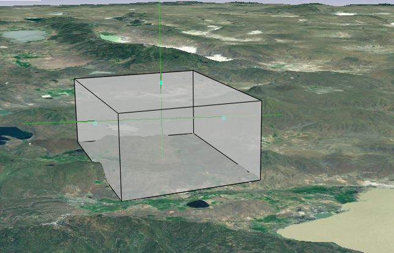

## multiwindow

## shapebuilder

## symbology

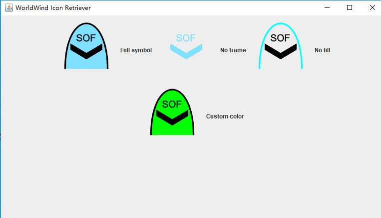

## tutorial

## util

##

Airspaces

AlarmIcons

AnnotationControls

Annotations
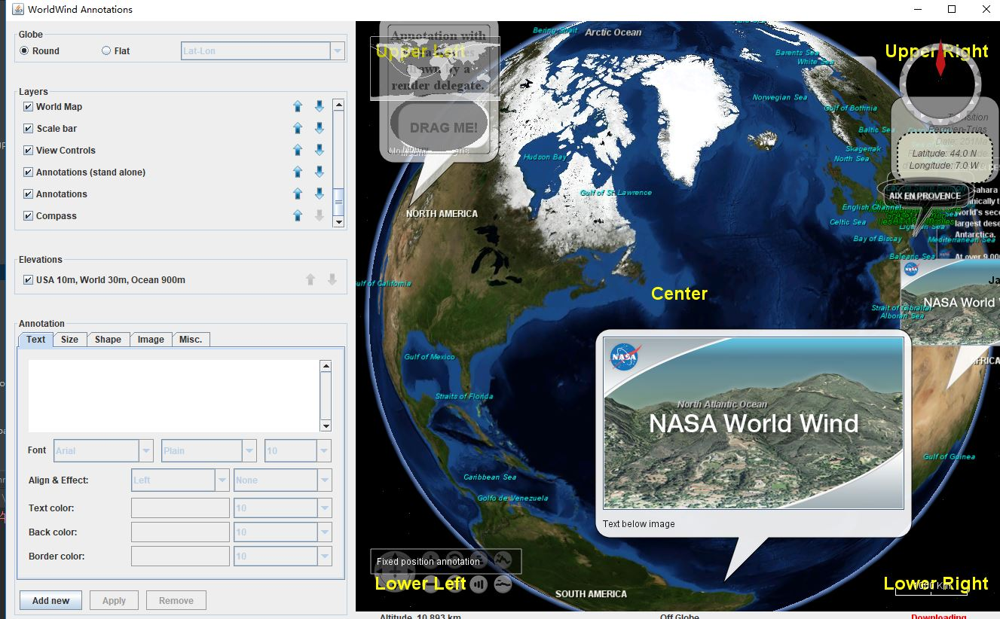
Balloons

Boxes

Cones
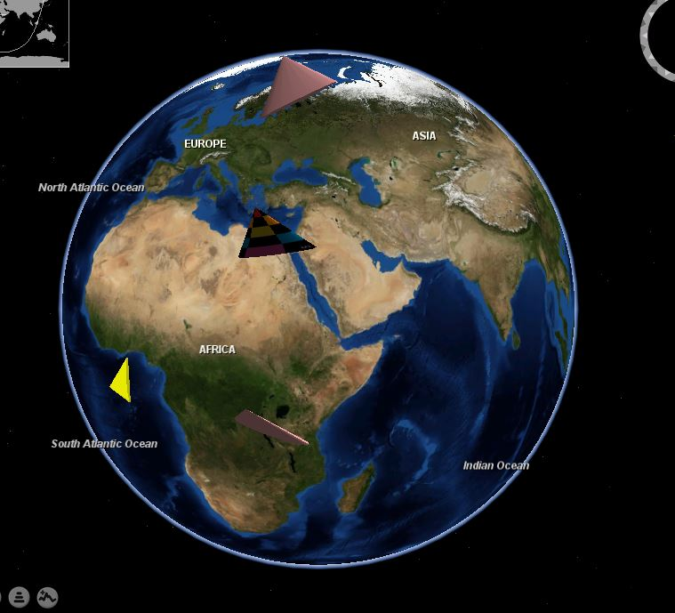

ContourBuilderExample

ContourLines

DimGlobeSurface

ExtrudedPolygonsFromShapefile
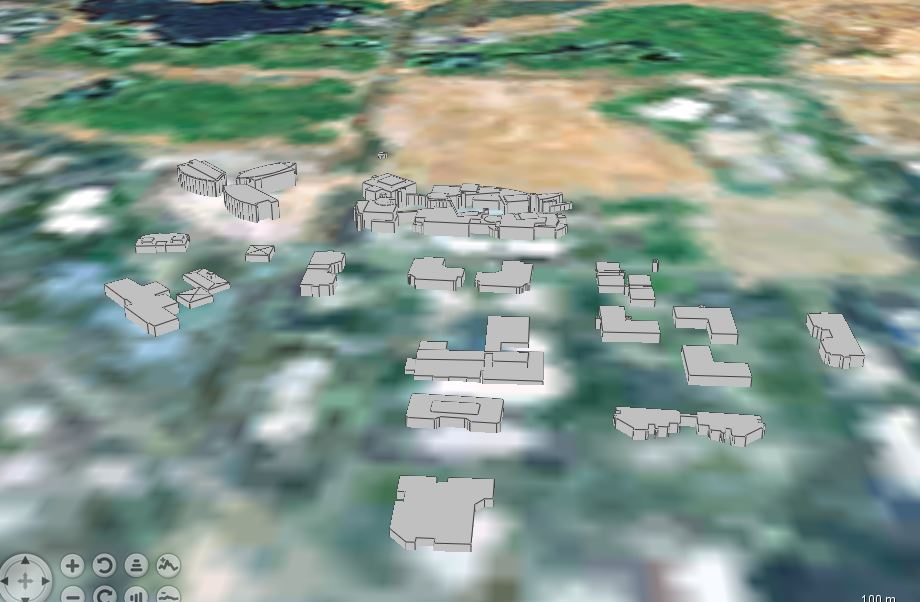

ExtrudedShapes

FlatWorldEarthquakes

GARSGraticule

GPSTracks

Graticule

LayerTreeUsage

LineBackground

LineBuilder
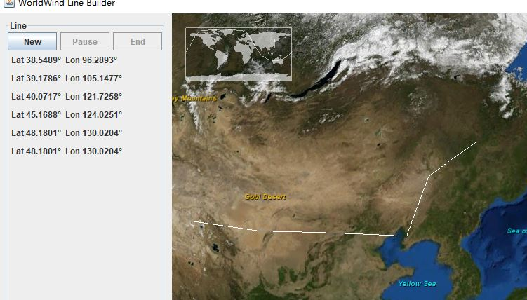
Markers

MarkersOrder
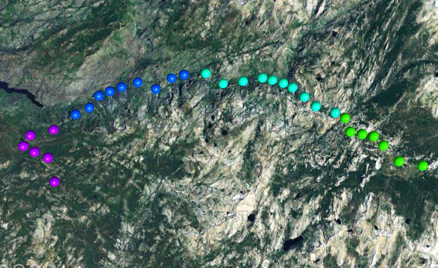
MeasureToolUsage

MGRSGraticule
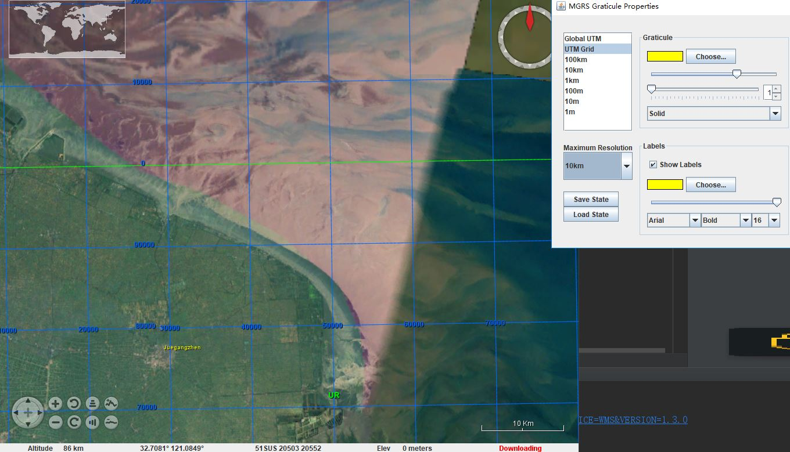
MultiResPath

OnScreenLayerManager

ParallelPaths

PathPositionColors

Paths
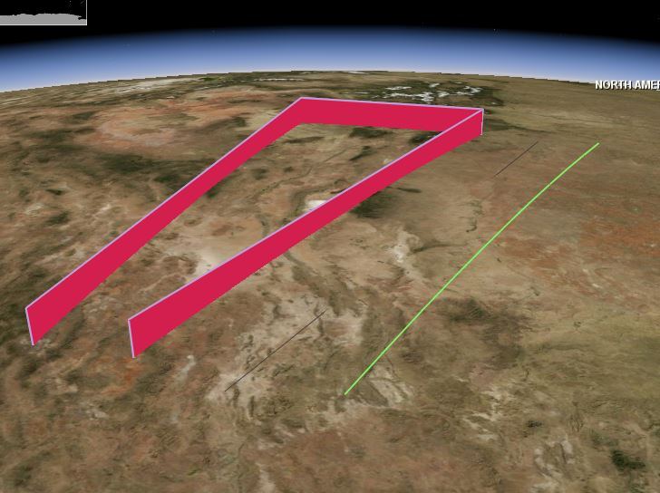
PathsOnDateline

PathsWithDirection

PathsWithLabels

PickFrustum

PlacemarkDecluttering
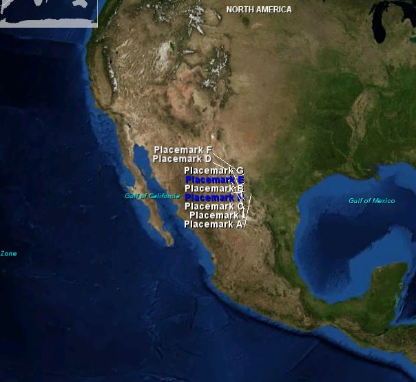
PlacemarkLabelEditing
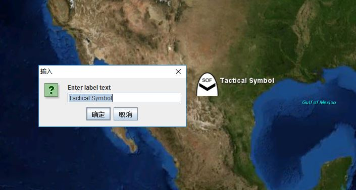
Placemarks

PlaceNames

Polygons
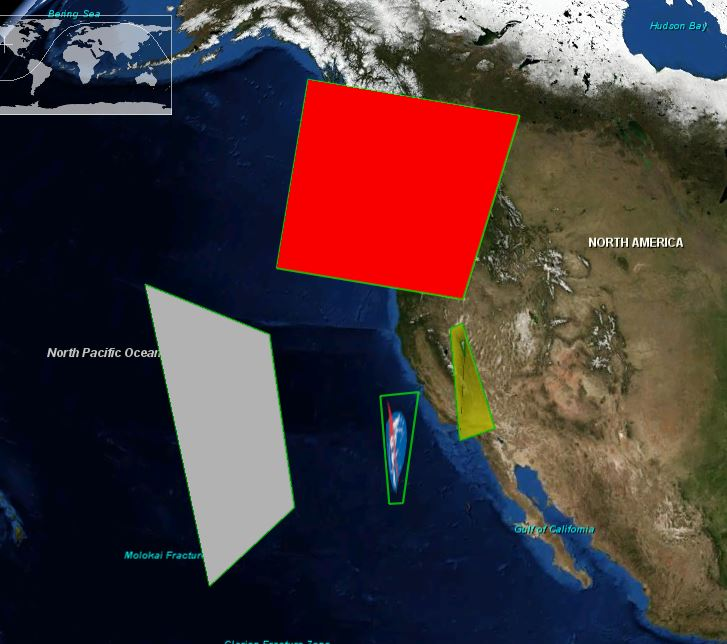
Pyramids
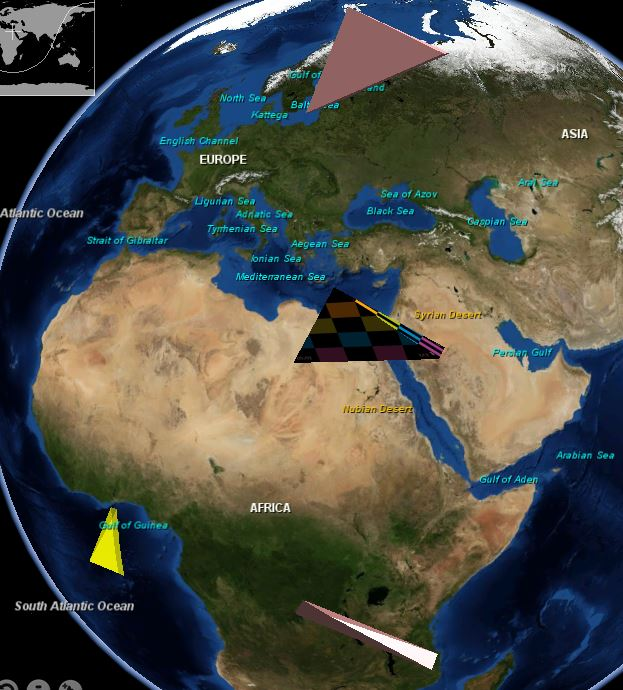
RemoteSurfaceImage

RigidShapes

RotatedSector

ScreenImageDragging

ScreenSelection
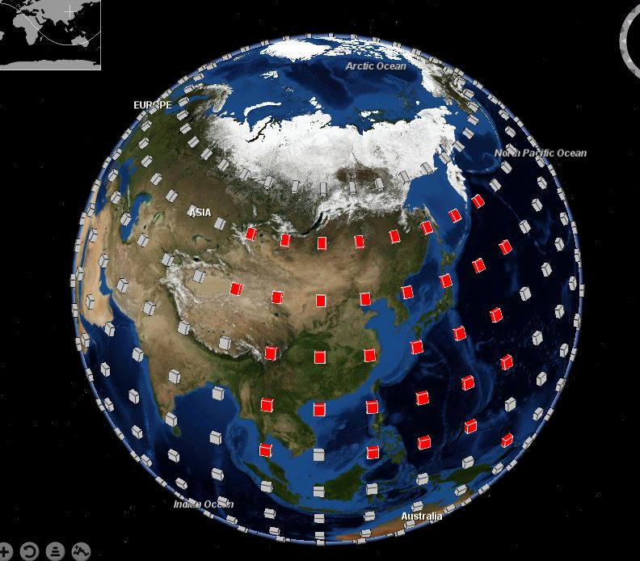

ScreenShots

SectorSelection
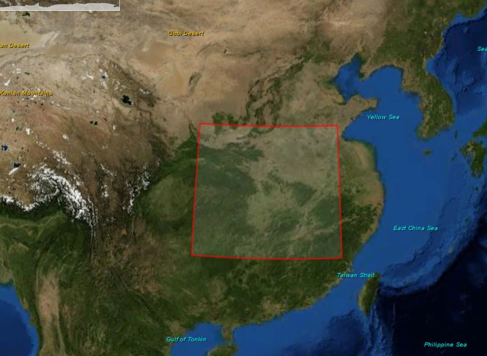

ShapeClipping
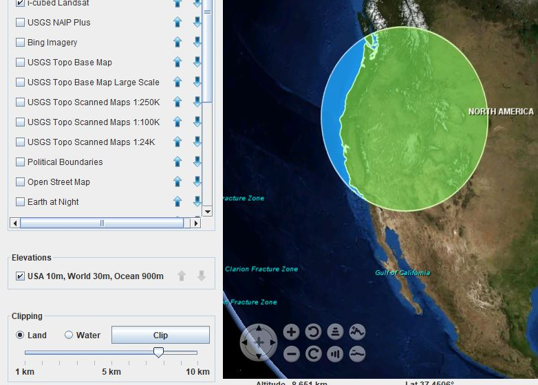
ShapeCombining
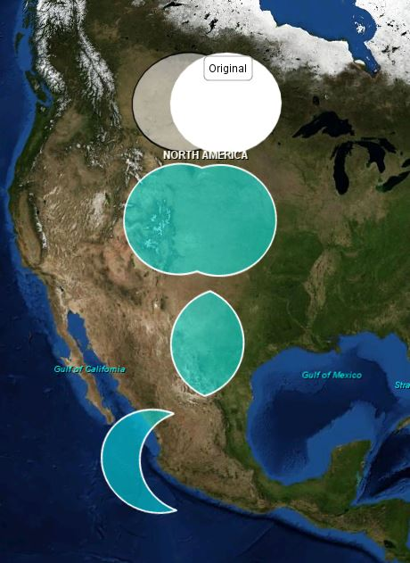
ShapeEditing

ShapeEditingExtension

ShapefileAttributeGroups

Shapefiles

Shapes

Shutdown
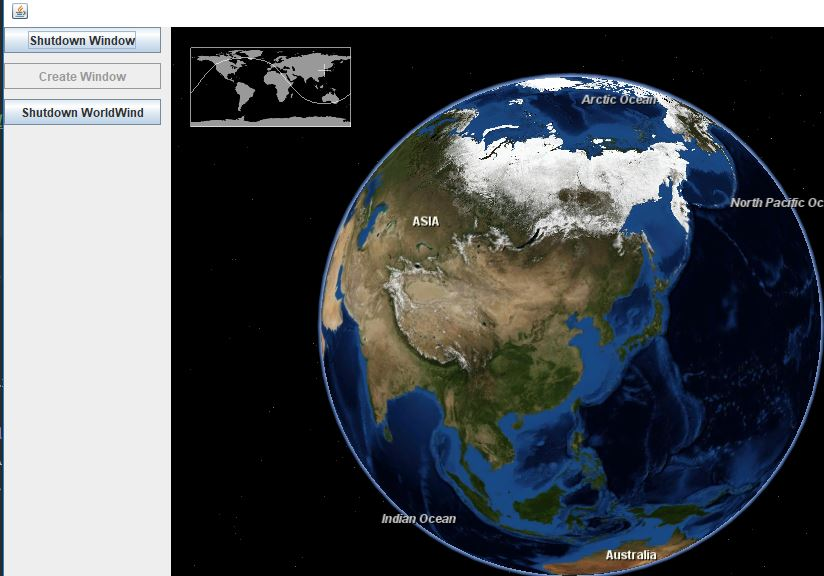
SimpleShapeDragging

SplitPaneUsage

StatisticsPanel

Stereo

SurfaceImages
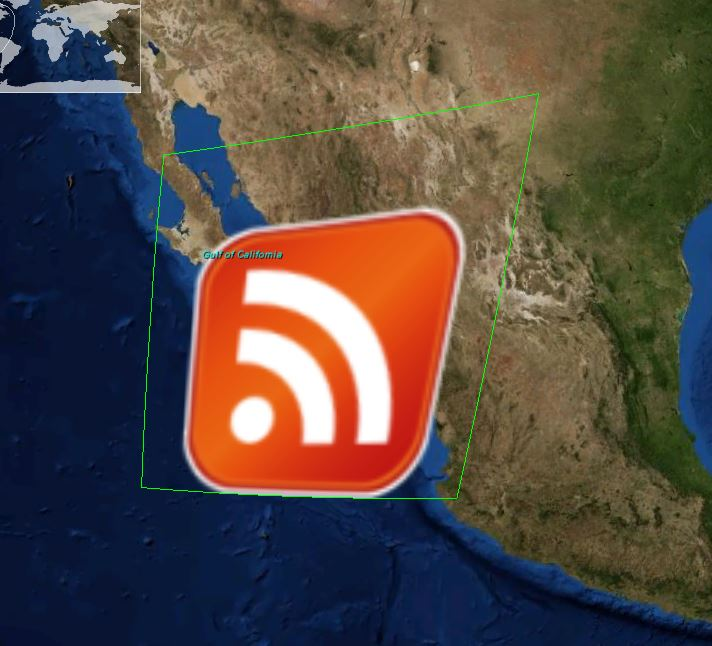
SurfaceShapes

SurfaceTextUsage

TerrainProfiler
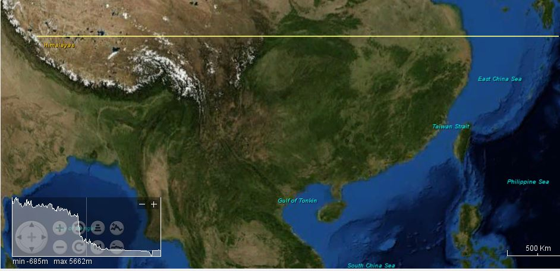

TreeFiltering

VideoOnTerrain

ViewControls
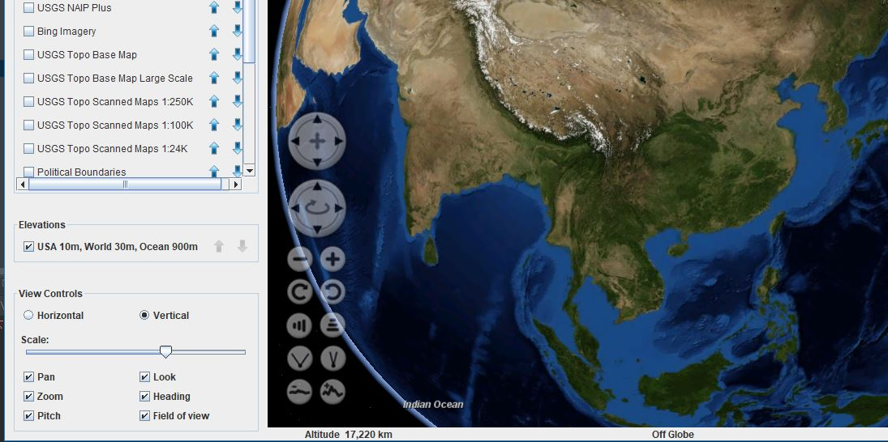
ViewIteration

ViewLimits
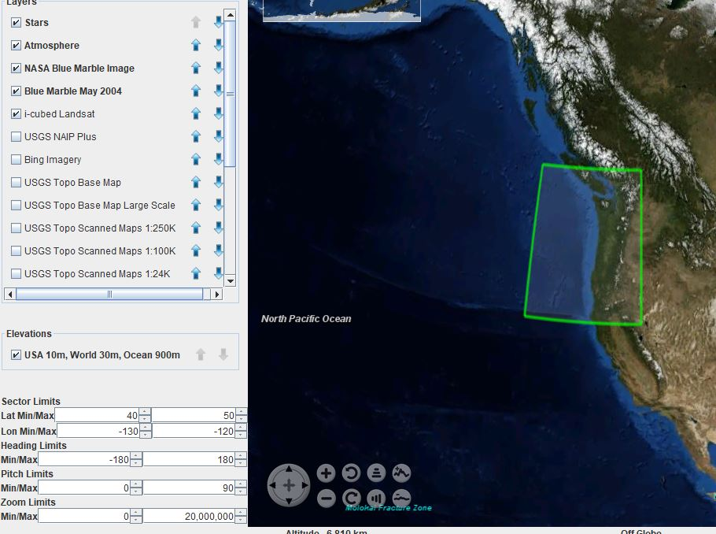
ViewLookAround

WebBrowserBalloons
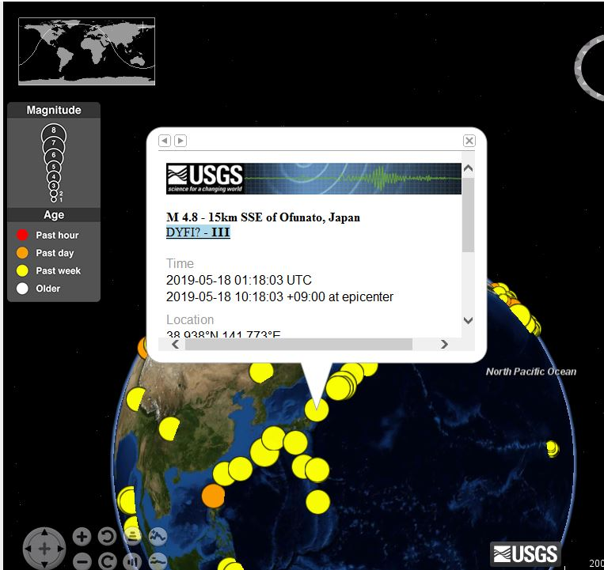

## performance

验证效率

---

## ExtrudedPolygonIntersection

retrieve ： 取回
intersections： 交叉点

## GridOfPoints 区域内绘制很多点

## LinesOfSight 视线

## PolygonIntersection 多边形与线交点

## multiwindow/CardLayoutUsage
This class illustrates how to use multiple WorldWind windows with a {@link CardLayout} layer manager.

## FlatAndRoundGlobes

## SharedShapes
This example shows how to share WorldWind shapes between two {@link WorldWindow} instances. In this example the two
 * WorldWind windows share imagery layers and the layers representing each type of shape. Though this example uses a
 * different globe for each window, it is possible for the two windows to share the same {@link Globe} as is done in the
 * {@link MultiFrame} example.
 * 
 

## TabbedPaneUsage

## ViewViewVolume 控制视角

应该可以通过它获取所看的经纬度范围。

## shapebuilder/ExtrudedPolygonBuilder

- 新建几何图形
- 修改大小（通过修改关键点）
- 根据视角进行自动调节大小

## RigidShapeBuilder
RigidShapeBuilder is a tool for creating and editing 3D shapes and placing them on the globe. Possible shapes include
 * the Rigid Shapes ({@link gov.nasa.worldwind.render.Ellipsoid}, {@link gov.nasa.worldwind.render.Box}, {@link
 * gov.nasa.worldwind.render.Cylinder}, {@link gov.nasa.worldwind.render.Cone}, {@link
 * gov.nasa.worldwind.render.Pyramid} and {@link gov.nasa.worldwind.render.Wedge}) as well as {@link
 * gov.nasa.worldwind.render.ExtrudedPolygon}.  The RigidShapeBuilder user interface allows the user to select the
 * desired shape from a dropdown menu, create an instance of it with the click of a button, and specify an "edit mode"
 * for modifying the shape: move, scale, rotate, skew, or texture.  Numerous shapes may be created and placed on the
 * globe together, but only one may be selected and edited at any given time.
 * 
 
新建多种几何图形

旋转
修改大小
移动
等等

## IconRetrieverUsage

## Symbology

## TacticalGraphics

## TacticalSymbols

## TreeControl

## Airspaces

## AlarmIcons 警示标志，闪动、脉搏、自定义图形

## AnnotationControls

## Annotations

左下角有属性面板。

四角，中心固定标志。

## Balloons

支持html

## Boxes

## BulkDownload

框选范围

下载影像，高程

## Cones

调节颗粒度

## ContextMenusOnShapes

## ContourBuilderExample

等高线。根据原始矩阵数据生成等高线

## ContourLines

设置高度，生成等高线

## ExtrudedPolygonsFromShapefile

## ExtrudedShapes

## FlatWorldEarthquakes

模拟显示地震情况

## GARSGraticule ： GARS划线

## GPSTracks

## Graticule划线

## IconPicking
鼠标悬浮在地球的图标上触发事件

## KeepingObjectsInView

悬浮通知

地标大小随视角高度变化而不变。

## LineBackground

## LineBuilder
创建线

## Markers

## MarkersOrder

## MeasureToolUsage

## MGRSGraticule

MGRS坐标系

## MultiResPath

## OnScreenLayerManager

## ParallelPaths

## PathPositionColors

## PathsOnDateline

## PathsWithDirection

## PathsWithLabels

## PlacemarkDecluttering

## PlacemarkLabelEditing

## Placemarks

## PlaceNames

## RemoteSurfaceImage

## RotatedSector
旋转几何图形

## RubberSheetImage
贴图

## ScreenImageDragging
鼠标点击处贴图标

## ScreenSelection
画框选择

## ScreenShots
截屏

## SectorSelection
画框选择

## ShapeClipping

矢量与矢量求交

## ShapeEditing

## ShapefileAttributeGroups

shaper文件加载，鼠标悬浮

## ShapefileViewer

shp 点 线 面

## Stereo
anaglyph： 浮雕
stereo： 立体声

## SurfaceImages

## SurfaceTextUsage

## TerrainProfiler
高程分析

## VideoOnTerrain

## ViewControls

## ViewIteration

视点运动

## ViewLimits
视场固定

左右上下前后移动范围被限制

---
# performance

## AntennaViewer 
天线展示

## GliderTestApp ？？
glider 滑翔

## SAR
 飞行模拟
 
 

## WorldWindow

